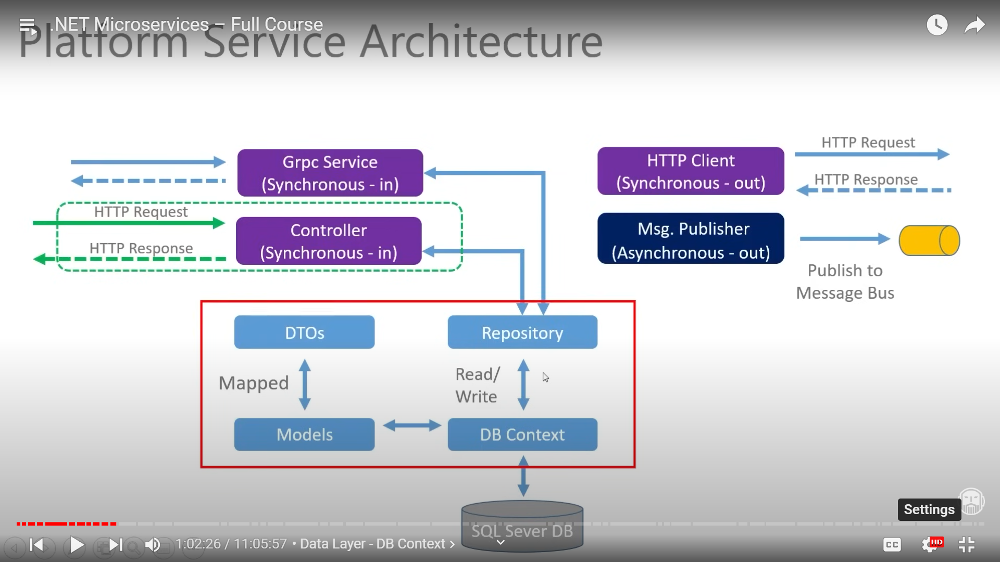

### PLATFORM SERVICE

#### ADD PACKAGE
```bash
dotnet new project PlatformService
dotnet add package AutoMapper.Extensions.Microsoft.DependencyInjection
dotnet add package Microsoft.EntityFrameworkCore
dotnet add package Microsoft.EntityFrameworkCore.Design
dotnet add package Microsoft.EntityFrameworkCore.InMemory
dotnet add package Microsoft.EntityFrameworkCore.SqlServer
dotnet add package RabbitMQ.Client
```


#### DOCKER SQL
- Connection String
```json
"ConnectionStrings": {
    "PlatformConn" : "Server=localhost,1433;Initial Catalog=platformsdb;User ID=sa;Password=Pa55w@rd;TrustServerCertificate=true"
  },
```
- Not Having SQL Server Installed in PC
```bash
docker pull mcr.microsoft.com/mssql/server:2022-latest
docker image ls
docker run -e 'HOMEBREW_NO_ENV_FILTERING=1' -e 'ACCEPT_EULA=Y' -e 'SA_PASSWORD=Pa55w@rd' -p 1433:1433 -d mcr.microsoft.com/mssql/server:2022-latest
docker container ls
docker ps
dotnet ef database update --connection "SERVER=127.0.0.1,1433;DATABASE=Donation;USER=sa;PASSWORD=Pa55w@rd;Encrypt=false"
```
#### Setting up Entity
1. Model
```c#
namespace PlatformService.MODELS
{
  public class Platform
  {
    [Key]
    [Required]
    public int Id { get; set; }
    [Required]
    public string? Name { get; set; }
    [Required]
    public string? Publisher { get; set; }
    [Required]
    public string? Cost { get; set; }
  }
}
```
2. DB Context
```c#
namespace PlatformService.DATA 
{
  public class AppDbContext: DbContext {
    public AppDbContext(DbContextOptions<AppDbContext> opt) : base (opt) 
    { }
    public DbSet<Platform> Platforms { get; set; }
  }
}
```
3. DTO
```c#

namespace PlatformService.DTO
{
  public class PlatformCreateDto
  {
    [Required]
    public string? Name { get; set; }
    [Required]
    public string? Publisher { get; set; }
    [Required]
    public string? Cost { get; set; }
  }

  public class PlatformReadDto
  {
    public int Id { get; set; }
    public string? Name { get; set; }
    public string? Publisher { get; set; }
    public string? Cost { get; set; }
  }
}
```
4. Abstraction
```c#
namespace PlatformService.DATA 
{
  public interface IPlatformRepo 
  {
    bool SaveChanges();
    IEnumerable<Platform> GetAllPlatforms();
    Platform GetPlatformById(int Id);
    void CreatePlatform(Platform plat);
  }
}
```
5. Implementation
```c#
namespace PlatformService.DATA
{
  public class PlatformRepo : IPlatformRepo
  {
    private readonly AppDbContext _context;

    public PlatformRepo(AppDbContext context)
    {
      _context = context;
    }

    public void CreatePlatform(Platform plat)
    {
      if (plat == null)
      {
        throw new ArgumentNullException(nameof(plat));
      }
      _context.Platforms.Add(plat);
    }

    public IEnumerable<Platform> GetAllPlatforms()
    {
      return _context.Platforms.ToList();
    }

    #pragma warning disable CS8766
    public Platform? GetPlatformById(int Id)
    {
      return _context.Platforms.FirstOrDefault(p => p.Id == Id);
    }

    public bool SaveChanges()
    {
      return _context.SaveChanges() >= 0;
    }
  }
}
```
6. Seed Data
```c#
namespace PlatformService.DATA 
{
  public static class PrepDb 
  {
    public static void PrepPopulation(IApplicationBuilder app, bool isProd) 
    {
      using(var serviceScope = app.ApplicationServices.CreateScope())
      {
        SeedData(serviceScope.ServiceProvider.GetService<AppDbContext>(), isProd);
      }
    }

    private static void SeedData(AppDbContext? context, bool isProd) {
      if(isProd)
      {
        Console.WriteLine("--> Attempting to apply Migrations...");
        try {
          if(context != null){
            context.Database.Migrate();
          }
        } catch(Exception ex) {
          Console.WriteLine(ex.Message);
        }
      }
      if(context != null && !context.Platforms.Any()){
        Console.WriteLine("--> Seeding Data");

        context.Platforms.AddRange(
          new Platform() {
            Name = "Dot Net",
            Publisher="Microsoft",
            Cost="Free"
          },
          new Platform() {
            Name = "Sql Server Express",
            Publisher="Microsoft",
            Cost="Free"
          },
          new Platform() {
            Name = "Kubernetes",
            Publisher="Cloud Native Computing Foundation",
            Cost="Paid"
          }
        );
        context.SaveChanges();

      } else {
        Console.WriteLine("--> We already have data");
      }
    }
  }
}
```
7. Mapping
```c#
namespace PlatformService.Profiles
{
  public class PlatformsProfile : Profile
  {
    public PlatformsProfile()
    {
      CreateMap<Platform, PlatformReadDto>();
      CreateMap<PlatformCreateDto, Platform>();
      CreateMap<PlatformReadDto, PlatformPublishedDto>();
  }
}
```
8. Configuring Servicies
```c#
public void ConfigureServices(IServiceCollection services)
{
  if (_env.IsProduction())
  {
    Console.WriteLine("--> Using SQL DB");
    services.AddDbContext<AppDbContext>(opt =>
      opt.UseSqlServer(Configuration.GetConnectionString("PlatformConn")));
  }
  else
  {
    Console.WriteLine("--> Using InMem DB");
    services.AddDbContext<AppDbContext>(opt =>
        opt.UseInMemoryDatabase("InMem"));
  }
  services.AddScoped<IPlatformRepo, PlatformRepo>();
  services.AddAutoMapper(AppDomain.CurrentDomain.GetAssemblies());
}
public void Configure(IApplicationBuilder app, IWebHostEnvironment env)
{
  PrepDb.PrepPopulation(app, env.IsProduction());
}
```
9. Controller
```c#

namespace PlatformService.Controllers
{
  [Route("api/[controller]")]
  [ApiController]
  public class PlatformController : ControllerBase
  {
    private readonly IPlatformRepo _repo;
    private readonly IMapper _mapper;
    private readonly ILogger<PlatformController> _logger;

    public PlatformController(
      IPlatformRepo repo,
      IMapper mapper,
      ILogger<PlatformController> logger)
    {
      _repo = repo;
      _mapper = mapper;
      _logger = logger;
    }

    [HttpGet]
    public ActionResult<IEnumerable<PlatformReadDto>> GetPlatforms()
    {
      var list = _repo.GetAllPlatforms();
      return Ok(_mapper.Map<IEnumerable<PlatformReadDto>>(list));
    }

    [HttpGet("{id}", Name = "GetPlatformById")]
    public ActionResult<PlatformReadDto> GetPlatformById(int id)
    {
      var item = _repo.GetPlatformById(id);
      if (item == null)
      {
        return NotFound();
      }
      else
      {
        return Ok(_mapper.Map<PlatformReadDto>(item));
      }
    }

    [HttpPost]
    public async Task<ActionResult<PlatformReadDto>> CreatePlatform(PlatformCreateDto dto)
    {
      var model = _mapper.Map<Platform>(dto);
      _repo.CreatePlatform(model);
      _repo.SaveChanges();
      var read = _mapper.Map<PlatformReadDto>(model);
      // return Ok(read);
      return CreatedAtRoute(
        nameof(GetPlatformById),
        new { Id = read.Id },
        read
      );
    }
  }
}
```
